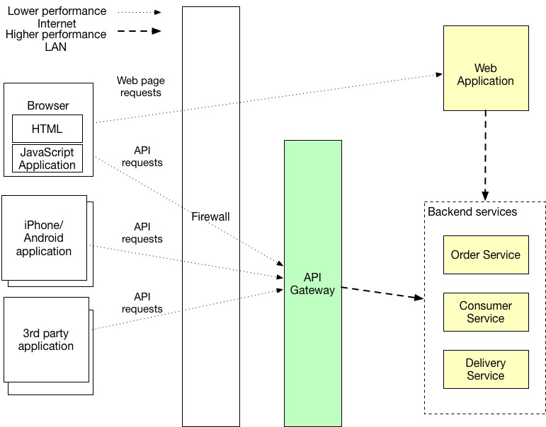
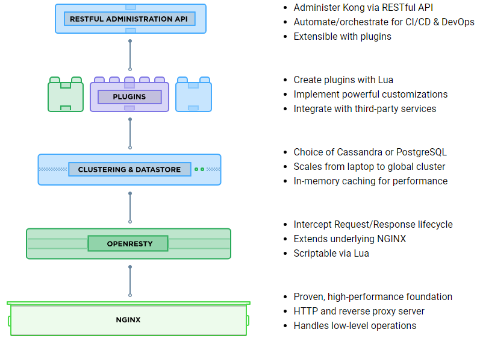
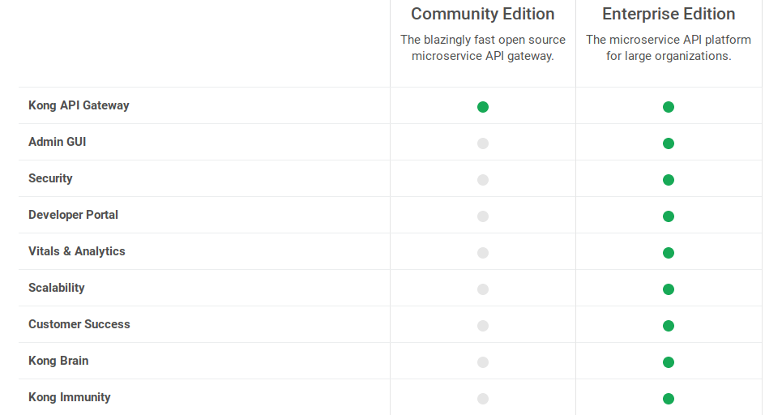
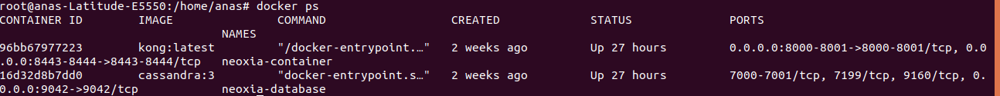

# Kong API Gateway and Spring Boot Microservices
## Context
Working with a microservices API gateway can greatly reduce coding efforts, make applications far more efficient, and decrease
errors all at that same time. An advantage of using microservices is that we don’t have to interact with a huge code base. 
Microservices are small and flexible. we can choose precisely which bits of code you want to interact with and from where 
those bits come. It’s possible to mix and match bits of code as needed. 

However, in a microservices architecture, each microservice exposes a set of (typically) fine-grained endpoints. This fact can impact the client-to-microservice communication.
### Direct client-to-microservice communication
A possible approach is to use a direct client-to-microservice communication architecture. In this approach, a client app can make 
requests directly to some of the microservices.


In this approach, each microservice has a public endpoint, sometimes with a different TCP port for each microservice.

In a production environment based on a cluster, that URL would map to the load balancer used in the cluster, which in turn 
distributes the requests across the microservices. In production environments, we could have an Application Delivery Controller
(ADC) between microservices and the Internet. This acts as a transparent tier that not only
performs load balancing, but secures your services by offering SSL termination. This improves the load of hosts by 
offloading CPU-intensive SSL termination and other routing duties to the ADC. In any case, a load balancer and ADC are transparent
from a logical application architecture point of view.

A direct client-to-microservice communication architecture could be good enough for a small microservice-based application,
especially if the client app is a server-side web application like an ASP.NET MVC app. However, when you build large and complex
microservice-based applications (for example, when handling dozens of microservice types), and especially when the client apps 
are remote mobile apps or SPA web applications, that approach faces a few issues.

Let’s imagine we are building an online store that uses the Microservice architecture pattern and that we are implementing
the product details page. we need to develop multiple versions of the product details user interface:
* HTML5/JavaScript-based UI for desktop and mobile browsers - HTML is generated by a server-side web application
* Native Android and iPhone clients - these clients interact with the server via REST APIs

In addition, the online store must expose product details via a REST API for use by 3rd party applications.

A product details UI can display a lot of information about a product. For example, the Amazon.com details page for POJOs 
in Action displays:
  * Basic information about the book such as title, author, price, etc.
  * Your purchase history for the book
  * Availability
  * Buying options
  * Other items that are frequently bought with this book
  * Other items bought by customers who bought this book
  * Customer reviews
  * Sellers ranking
  * ...

Since the online store uses the Microservice architecture pattern the product details data is spread over multiple services. 
For example:
  * Product Info Service - basic information about the product such as title, author
  * Pricing Service - product price
  * Order service - purchase history for product
  * Inventory service - product availability
  * Review service - customer reviews …

Consequently, the code that displays the product details needs to fetch information from all of these services.
#### Problem
How do the clients of a Microservices-based application access the individual services?
#### Forces


   * The granularity of APIs provided by microservices is often different than what a client needs. Microservices typically
   provide fine-grained APIs, which means that clients need to interact with multiple services. 
   For example, as described above, a client needing the details for a product needs to fetch data from numerous services.

   * Different clients need different data. For example, the desktop browser version of a product details page desktop is
   typically more elaborate then the mobile version.

   * Network performance is different for different types of clients. For example, a mobile network is typically much slower
   and has much higher latency than a non-mobile network. And, of course, any WAN is much slower than a LAN. This means that
   a native mobile client uses a network that has very difference performance characteristics than a LAN used
   by a server-side web application. The server-side web application can make multiple requests to backend 
   services without impacting the user experience where as a mobile client can only make a few.

   * The number of service instances and their locations (host+port) changes dynamically

   * Partitioning into services can change over time and should be hidden from clients

   * Services might use a diverse set of protocols, some of which might not be web friendly
#### Solution
Implement an API gateway that is the single entry point for all clients. The API gateway handles requests in one of two ways.
Some requests are simply proxied/routed to the appropriate service. It handles other requests by fanning out to multiple
services.
###  API Gateways
In a microservices architecture, the client apps usually need to consume functionality from more than one microservice. 
If that consumption is performed directly, the client needs to handle multiple calls to microservice endpoints. 
What happens when the application evolves and new microservices are introduced or existing microservices are updated? 
If the application has many microservices, handling so many endpoints from the client apps can be a nightmare. 
Since the client app would be coupled to those internal endpoints, evolving the microservices in the future can cause 
high impact for the client apps.

When we design and build large or complex microservice-based applications with multiple client apps, a good approach to consider
can be an API Gateway. This is a service that provides a single-entry point for certain groups of microservices. It's similar
to the Facade pattern from object-oriented design, but in this case, it's part of a distributed system. The API Gateway pattern 
is also sometimes known as the "backend for frontend" (BFF) because we build it while thinking about the needs of the client app.

Therefore, the API gateway sits between the client apps and the microservices. It acts as a reverse proxy, routing requests
from clients to services. It can also provide additional cross-cutting features such as authentication, SSL termination, 
and cache.



This example shows the API Gateway pattern implementation.
#### Resulting context
Using an API gateway has the following benefits:

   * Insulates the clients from how the application is partitioned into microservices
   * Insulates the clients from the problem of determining the locations of service instances
   * Provides the optimal API for each client
   * Reduces the number of requests/roundtrips. For example, the API gateway enables clients to retrieve data from multiple 
   services with a single round-trip. Fewer requests also means less overhead and improves the user experience. 
   An API gateway is essential for mobile applications.
   * Simplifies the client by moving logic for calling multiple services from the client to API gateway
   * Translates from a “standard” public web-friendly API protocol to whatever protocols are used internally
## Kong API Gateway
### Definition
Kong is Orchestration Microservice API Gateway. Kong provides a flexible abstraction layer that securely manages communication
between clients and microservices via API. Also known as an API Gateway, API middleware or in some cases Service Mesh.
It is available as open-source project in 2015, its core values are high performance and extensibility.

Kong is a Lua application running in Nginx and made possible by the lua-nginx-module.

Kong can help by acting as a gateway (or a sidecar) for microservices requests while providing load balancing, logging, 
authentication, rate-limiting, transformations, and more through plugins.


Once the Kong gateway is running, it will expose two endpoints:
  * A proxy endpoint where consumers can send all their traffic to;
  * A management endpoint, also known as Kong Management API, to configure the gateway itself.

Administrators can use the Admin REST API or CLI to configure the gateway which allows them to fully script repetitive tasks.
However, there is no out-of-the-box support for infrastructure-as-code to manage your gateway.

Every gateway is backed by a data store that contains all the relevant configuration which can be stored in Apache Cassandra
or PostgreSQL. This is also where Kong shines as it is a cluster-based technology that allows to easily scale out by adding 
more nodes, but it still only requires one data store making it easier to manage.

Here is a bird’s-eye overview of the gateway stack:


### Features and Plugins
Kong provide a collection of plugins that accelerate development time:

  * Authentication plugin that we could choose from Basic authentication, JWT, LDAP, OAUTH2;
  * Security plugin that additional security layers such as ACL, CORS, Dynamic SSL, IP Restriction;
  * Traffic control plugin is a very useful for limited cost such as rate limiting, request size limiting, response rate limiting;
  * Serverless – Invoke serverless functions via APIs
  * Analytics and monitoring plugin that visualise, inspect and monitor API traffic such as Prometheus, data dog and Runscope;
  * Transformation plugin that transform request and responses on the fly such as Request Transformer, Response Transformer;
  * Logging plugin that log request and response data using the best transport for your infrastructure: TCP, UDP, HTTP, StatsD,
  Syslog;
  * ...
### Distributions
  * Kong Docker: A Dockerfile for running Kong in Docker.
  * Kong Packages: Pre-built packages for Debian, Red Hat, and OS X distributions (shipped with each release).
  * Kong Vagrant: A Vagrantfile for provisioning a development-ready environment for Kong.
  * Kong Homebrew: Homebrew Formula for Kong.
  * Kong CloudFormation: Kong in a 1-click deployment for AWS EC2.
  * Kong AWS AMI: Kong AMI on the AWS Marketplace.
  * Kong on Microsoft Azure: Run Kong using Azure Resource Manager.
  * Kong on Heroku: Deploy Kong on Heroku in one click.
  * Kong and Instaclustr: Let Instaclustr manage your Cassandra cluster.
  * Kubernetes Ingress Controller for Kong: Use Kong for Kubernetes Ingress.
  * Nightly Builds: Builds of the master branch available every morning at about 9AM PST.
### Kong Community Edition vs Entreprise Edition 

Kong Enterprise takes API management a step further and comes with all the tooling that we need to manage a full-blown
infrastructure.




## Getting Started
### Pre-requise
  * Operating system (Linux, Windows, MacOS...);
  * Docker;
  * Postgres or Cassandra DB.
### Kong Setup
#### 1.1 Create docker network
First create docker network.
```bash
docker network create neoxia-net
```
#### 1.2 Initialize database
Kong can interface with either Cassandra or Postgres. I this example we will use Cassandra DB.
##### NB:
The two main reasons why one would choose Cassandra as Kong's datastore are: 
  - An ease to create a distributed setup (ideal for multi-region);
  - Ease to scale
```bash
docker run -d --name neoxia-database \
               --network=neoxia-net \
               -p 9042:9042 \
               cassandra:3
```
Then prepare the database for Kong.
```bash
docker run --rm \
     --network=neoxia-net \
     -e "KONG_DATABASE=cassandra" \
     -e "KONG_CASSANDRA_KEYSPACE=neoxia" \
     -e "KONG_CASSANDRA_CONTACT_POINTS=neoxia-database" \
     kong:latest kong migrations bootstrap
```
#### 1.3 Initialize kong
```bash
docker run -d --name neoxia-container\
     --network=neoxia-net \
     -e "KONG_DATABASE=cassandra" \
     -e "KONG_CASSANDRA_KEYSPACE=neoxia" \
     -e "KONG_CASSANDRA_CONTACT_POINTS=neoxia-database" \
     -e "KONG_ADMIN_LISTEN=0.0.0.0:8001, 0.0.0.0:8444 ssl" \
     -p 8000:8000 \
     -p 8443:8443 \
     -p 8001:8001 \
     -p 8444:8444 \
     kong:latest
```
After that, we have two running docker container, one for cassandra DB and another for kong instance.



Check Kong Instance.
```bash
curl -i http://localhost:8001
```
### Setup API server routing using Spring boot microservices
Clone this repository to your local machine.
#### 2.1 Create the Component
change location to Spring-Boot-Micro-Forex-Service folder, build a new image and run a new container.
```bash
cd pring-Boot-Micro-Forex-Service
docker build -t forex-image .
docker run --name forex-container --network=neoxia-net -p 8098:8098 forex-image
```
The server app is listned on port 8098 with endpoint /currency-exchange/from/EUR/to/INR:
http://localhost:8098/currency-exchange/from/EUR/to/INR

We can verify the connected containers to the neoxia-net docker network:
```bash
docker network inspect neoxia-net
```
#### 2.2  Declare the Component with Kong
##### 3.2.1 Create the service
Service refer to the upstream APIs and microservices that kong manages.
```bash
curl -i -X POST \
  --url http://localhost:8001/services/ \
  --data 'name=forex-service-v1' \
  --data 'url=http://localhost:8098/currency-exchange/from/EUR/to/INR'
```
